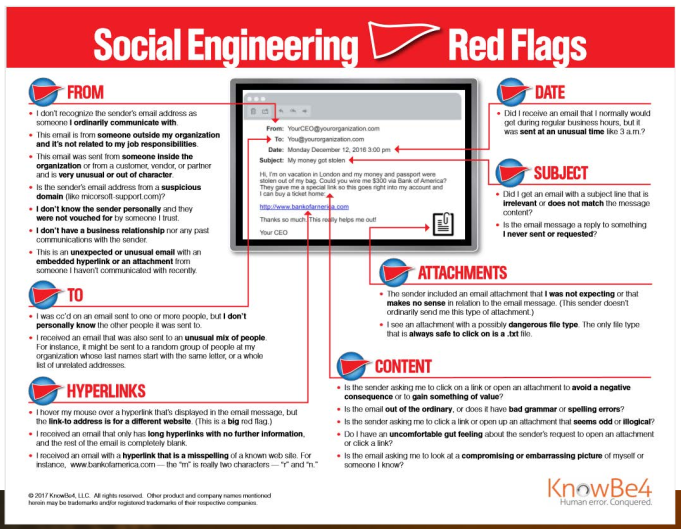
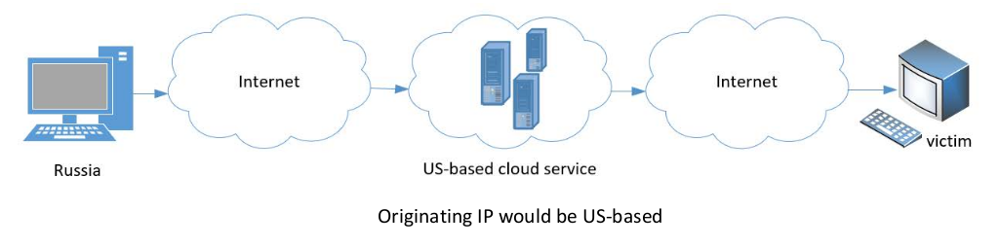

## Playbook: Phishing
As stated in the introduction, a Phishing attack is a type of social engineering attack where an attacker sends out a fraudulent message pretending to be from a trusted entity, ussually via email. The aim could be to trick the user into revealing sensitive information, or to deploy malicious software of the user's machine. **Spear phishin**g is a phishing attack targeted at specific individuals or groups within an organization

### Investigating Email Phishing

#### **Email Structure**
1. Message Body
   - Message
   - URLs
   - File Attachments
   - Embedded Images
1. Header Information
   - Required fields
   - Optional information

#### **Message Body** *(Signs of Maliciousness)*
  
- A File attachment image, not file attachment 
  - That image probably points to a malicious URL that the attacker wants you to click
- An Image that points to a URL link
- Disjointed “From/Received/Reply” email addresses 
- Mis-Branded URLs 
- Disconnected/bogus URLs
- Brand/URL mismatches
- Unexpected file attachments
- MIME-type mismatches
- Unexpected requests for actions
  - Instructions to Ignore Warnings or Activate Content
- Stressor claims

#### **Header Information**
- An Email header is changed or added each time the email passes through an email server/gateway/inspection service, which is Officially known as a ***Mail Transfer Agent (MTA)***
- You can use the header information to follow the email’s path from source to destination (in reverse time order)
  - ***Note:*** Sender or intermediate MTA can forge/change parts
- ***Viewing Email Headers***
  - ***Gmail*** - Open email, more (three dots on right), Show Original
  - ***Outlook*** - Open email, File, Properties, Internet Headers, Ctrl-A, Ctrl-C, paste into Notepad.exe

1. **Finding Original Sender**
   - `x-originating-ip` - public IP address of original sender (Unfortunately, optional)
   - `x-sender-ip` - represents the IP of the originating email server
1. **Received**
   - public IP address or domain name of original sender and intermediate MTAs (Required field)
   - Find the first one (at the bottom to find the original sender)
   - Different “style” per MTA
   - Remember, previous record can be modified or spoofed by intermediate MFA
   - Sometimes only shows domain name and you have to use `nslookup` to find IP address
      - `nslookup example.com`
   - You can use [`iplocation.net`](https://www.iplocation.net/) to find out general geo-location data of the IP address
   - Does the IP address of MTA belong to service it claims to be from?
      - Possibly malicious phish if MTA is a public SMTP SAS service from supposedly big brand name company
      - Examples (These are public email servers, so will probably not be used by a big company)
        - Smtp.com
        - Sendgrid.net
        - Constantcontact.com
        - Gmail
        - 0ffice 365
      - You can utilize [ARIN Whois/RDAP](https://search.arin.net/rdap/) to find more information about the IP address
   - Keep location attribution redirection tactics in mind  
   
1. Other
   - How old is domain registration creation? (Younger is more risky), use [Whois Domain Lookup](https://www.whois.com/whois/)
   - Is domain on a blacklist? Use [Mx ToolBox](https://mxtoolbox.com/blacklists.aspx) to check
   - Is domain healthy? 
   - Physical location of domain business? (Google Maps)
1. Global Phishing Protection Standards: ***Sender Policy Framework (SPF)*** and ***Domain Keys Identified Mail (DKIM)*** 
   - SPF protects YOUR domain against spoofing, when enabled, receivers can verify whether or not an email that claims to be from your domain is from your domain and DKIM verifies the integrity (and non-denial) of the email
   1. **SPF - Sender Policy Framework (SPF)**
      - Verifies the 5321 MAIL FROM domain name address
      - Pass = Verified Domain and Fail = Bad or Unverified Domain
   1. **DKIM - Domain Keys Identified Mail**
      - Uses public/private key pair to add a digital signature to every outgoing email that links the email to it’s sending Internet domain
      - Verified domain is found in the DKIM-Signature header
      - DKIM signatures typically cover most of the email message so that people cannot tamper with content of an email
        - However some of the email headers are NOT included in signature - specifically headers that tend to be modified as email flows across the Internet (like "Received:" and "Return-Path:" headers)
      - dkim=pass or dkim=fail
1. **X-headers**
   - X stands for “extra” or “experimental”
   - Can be added by an MTA
   - Can be used to store useful information or to track users
1. **Video Resources**
   - [How DKIM, SPF & DMARC Work to Prevent Email Spoofing](https://www.youtube.com/watch?v=KJM8IdP27cQ&ab_channel=MDaemonTechnologies)
   - [Email Headers Explained and How They Might Help You](https://www.youtube.com/watch?v=YSIs1M91uS8&ab_channel=AskLeo%21)

