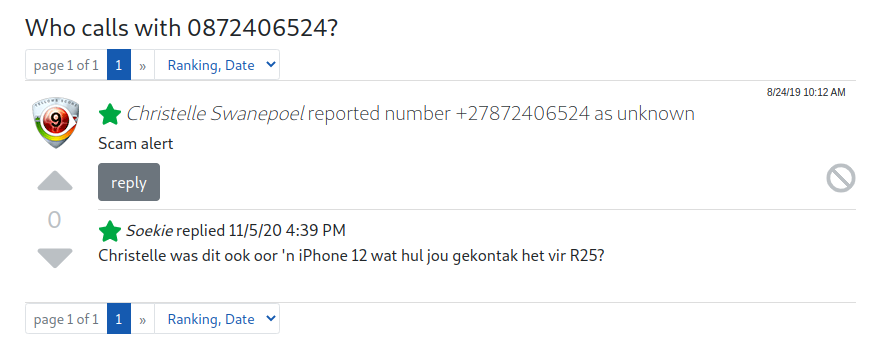

## Playbook: Smishing   
Smishing is a phishing attack carried out via the Short Message Service (SMS). Threat actors send users text messages purporting to be from a reputable 
company with the intent of tricking user to reveal personal information such as their identification number (which can lead to identity theft) or 
passwords. In the more extreme situations redirecting users to sites that contain  malicious software.  

**Disclaimer**  
*- This playbook is intended for educational purposes and may not necessarily represent the state-of-the-art, as such it might be updated from time to time. The goal is to introduce students/beginners to incident response. Feel free to contribute content relevent to the topic*  
*- It is adviced that investigations be carried out in an isolated enviroment such as a VM to avoid accidentally infecting your machine*

### Investigating Smishing
1. **URLs**
   - URLs in messages are shown “as-is”, making it reletively easy to spot suspicious one. The URL should be compared to that of the company the threat actors are claiming to represent. Threat actors will usually add a hyphen, or an extra letter in the domain to trick users into thinking that it is the original domain.
   - To conceal malicious URLs the attackers often use URL shorteners or in some cases send you to an actual site which then redirects you to a malicious one
   - Suspicious URLs should not be opened as they may send users to sites that contain malicious software, they should only be opened in isolated enviroments to monitor their impact, (more on this later).
1. **Convert short URLs to “expanded” URLs**
   - Because it can be difficult to determine the validity of a URL when it has been shortened, the URL should be *"expanded"*
   - [expandurl.net](https://www.expandurl.net/) is a service where you can find an expanded version of a shortened URL and other metadata about the destination site
3. **Is the URL Safe to open?**
   - To determine if a URL is safe to open, we will utilize online services that compares the URL against a list of known malicious URLs
   -  Of course some new URLs will not be in such databases so when necessary you can open the URL in a VM ans use proxies for full visibility, this is however not covered in this guide
   - Below is a list of online services you can use to determine if a URL is safe to visit
      - [VirusTotal](https://www.virustotal.com/gui/home/url)
      - [PhishTank](https://www.phishtank.com/)
      - [URLVoid](https://www.urlvoid.com/)
      - [Link checker](https://www.psafe.com/dfndr-lab/)
      - [Safe Browsing site status](https://transparencyreport.google.com/safe-browsing/search)
   - To view how the site looks like without actually opening the URL, use [Shrink the Web](https://shrinktheweb.com/). By simply providing a URL, the service will present you with screenshots of how the site looks like
5. **Phone Number Reverse Lookups**
   - We can also attempt to find more information about the number that send the message. Below are some of the tools to use:
      - [tellows](https://www.tellows.co.za/)
      - [Reverse Phone Lookup](http://www.reversephonelookup.com)
      - Also use the Google operator `" "` to find exact matches of the number (e.g `"011 111 1111"`)
      - You can also search the phone number of social media platforms such as Facebook or Twitter  
7. **SMS Short Code Reverse Lookups**
   - SMS Short Codes are used to send and receive messages, this provides another opportunity to find out more about the attacker
   - You can utilize the following sites to lookup SMS short codes:
      - [WASPA](https://codes.waspa.org.za/)
      - [WASPA](https://www.smscodes.co.za/index.asp)
      - [Shortcodes.org](https://shortcodes.org/#)
      - [SMS Gateway Center](https://www.smsgatewaycenter.com/trace-shortcode.html)

### Example Case - `A $1.95 iPhone 13?`
In this case a phisher using the number `+27872406524` send a user a message requesting them to confirm their credentials for a package delivery. It should be noted that the user was not expecting any package, so it is easy to see that this is a ploy to get their credentials. However with phishers sending out messages like this, it means somewhere somehow people are falling for the scam. We are perfoming this analysis to understand them more.  

1. **URL: `nevbf.com/90t4F0`**  
   - The URL in this case is displayed *"as-is"* so there is no need to use a service like `expandurl.net` however it can be used to find metadata about the site. 
   - We should determine if the URL is safe to open, we start by checking it on [VirusTotal](https://www.virustotal.com/gui/home/url). As we can see below the URL has not been flagged as malicious by vendoers
   
   - Scanning the URL on [URLVoid](https://www.urlvoid.com/) we can get more metadata as shown below
   
   
   - Although the URL is not flagged as malicious, it is adviced that it not be opened. Hence we utilize [Shrink the web](https://shrinktheweb.com/) to take screenshoots of the site, as shown below. We can see that in this attack, the phishers want the user to provide their **name, surname, email address and phone number** to buy an **iPhone 13** for the generous price of **$1.95**. With the alleged purchase the user will also have to provide them with their **banking details**, which clearly points out that the **motive of this attack is a financial one**, rather than identity theft. It is also important to note how there is a **countdown timer** indicating that this offer is valid only for the next 5 minutes. Attackers do this in order to get the user to perform an action they would not perform under normal circumstances, I'd imagine a user rushing to fill in all those details so that they can purchase their iPhone  
   
2. **Phone Number Reverse Lookups**
   - Now that we know the aim of the attack, let us try to find out who is behind it. The message was send from `+27872406524` which is a South African number
   - By seaching `"+27872406524"` on Google we get a few hits. On [tellows](https://www.tellows.co.za/) we see complains about this number going back as far as **2019**, in our case the message was received on **14 July 2022**. To have been active for such long with the same scam means it has been successful thus far, which is unfortunate. As shown below users are pointing out that this is a scam as you simply cannot buy an iPhone 12 in this case for `R25 ~ $1.4`. It is also important to note that this is a **VoIP** number, leading to an assumption that this could be an operation run out of a full fledged office. You can visit https://www.tellows.co.za/num/0872406524 to view all reviews about this number 
   
3. **Remarks**
   - If a site ever pressures you into a decision (like how the site in question indicated that the user only has 5 minutes to make the transation), this is ussually done to get you to act in a way that you would not if you stop to think about it
   - Also, if something is too good to be true, it's ussually a scam. Our attacker in this case is selling an iPhone 13 for the very generous price of $1.95 which is impossible considering the price range of the phone  
   - Users are adviced not to visit the site, as it has malicious intent

**Additional Information**
1. [Learn How to Forensically Examine Phishing Emails to Better Protect Your Organization Today](https://www.knowbe4.com/hubfs/KB4-ForensicsPhishing_Slides.pdf?hsLang=en)
1. [incident-response-plan-template](https://github.com/counteractive/incident-response-plan-template)

`TODO: model around Investigate, Remediate (contain, eradicate), and Communicate`
